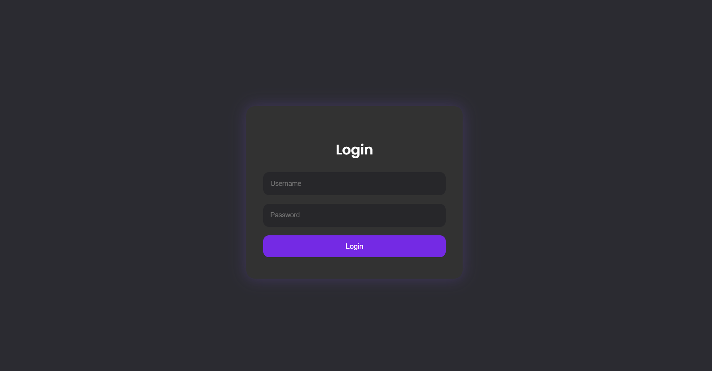
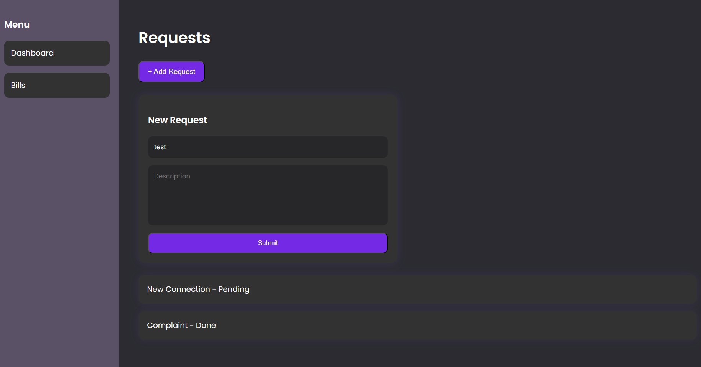

# NWC Frontend Application

## Preview

## Overview
This project is a simplified frontend application built using Angular, inspired by the NWC (National Water Company) e-Branch portal.

The main objective of this project is to demonstrate the ability to design and implement a structured, user-friendly frontend application using modern web technologies, without backend integration.

## Features

- Login page with basic validation  
- Dashboard with summary cards  
- Bills page:
  - List of bills  
  - Search and filtering  
  - Detailed bill view  
- Service Requests page:
  - List of requests  
  - Create a new request  
- Responsive layout for different screen sizes  
- Clean and simple user interface  

## Login Credentials

You can use the following credentials to access the application:

- Username: Rawan  
- Password: 1234

## Technologies Used
- Angular  
- TypeScript  
- HTML  
- CSS  

## How to Run the Project

1. Install dependencies:
npm install

2. Run the development server:
ng serve

3. Open your browser and navigate to:
http://localhost:4200

## Notes

- This project uses mock data only (no backend integration).  
- The focus of this project is on frontend structure, UI/UX, and function